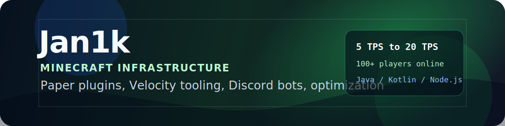

  

  
  
  

  

I build Minecraft server systems, Paper plugins, Velocity tools, and Discord integrations. Most of my work sits around performance, moderation, automation, and server-side features that need to survive real players.

My portfolio has the full project history: [jan1k.org](https://jan1k.org)

## current work

- SnifferStudio, my long-term studio project for Minecraft network tooling.
- ExploitSniffer, an anti-packet exploit plugin working at the proxy level.
- Paper and Velocity plugins for survival, PvP, moderation, and server operations.
- Discord.js bots for tickets, partnerships, AI support, recruiting, and server utilities.

## public projects

| project | stack | what it does |
| --- | --- | --- |
| [VilPickupV](https://github.com/Jan1k1/VilPickupV) | Java, Paper | Pick up and place villagers, including zombie villager equipment and optional database logging. |
| [BoosterRewards](https://github.com/Jan1k1/BoosterRewards) | Java, Discord API | Link Minecraft accounts to Discord and grant rewards when members boost a server. |
| [VoicechatMute](https://github.com/Jan1k1/VoicechatMute) | Java, Simple Voice Chat | Sync LiteBans or AdvancedBan mutes into proximity voice chat. |
| [asyncEnchantLimiter](https://github.com/Jan1k1/asyncEnchantLimiter) | Java, Paper | Enforce configured enchant limits across item changes, trades, loot, and anvils. |
| [jan1kessentials](https://github.com/Jan1k1/jan1kessentials) | Java, Paper | Essentials-style commands for gamemode, repair, teleport requests, trash, inventory, and ender chest access. |

## server work

I have worked around Minecraft servers for 4+ years, including setup, configuration, optimization, and custom plugin development. The work I care about most is simple: fix lag, remove messy workflows, and make staff tools faster.

Examples from my portfolio include BlissMC, LumenSMP, PlayMantle, RemixMC, jReports, PartnershipHub, BackdoorScanner, and the Jan1k Discord App.

## contact

Use [jan1k.org](https://jan1k.org) for contact links, or open an issue on the repo you are using.
