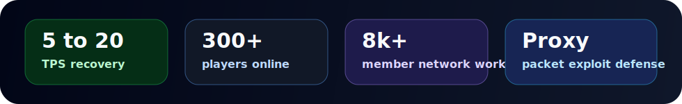

  

  
  
  

  

  

Minecraft configurator, optimizer, and developer. I work on Paper plugins, Velocity tooling, Discord automation, and server setups for active communities.

Right now I am focused on SnifferStudio and ExploitSniffer, a proxy-level anti-packet exploit project built to stop crash traffic before it reaches backend servers.

Full portfolio and contact: [jan1k.org](https://jan1k.org)

## main lane

| area | work |
| --- | --- |
| Minecraft development | Paper and Velocity plugins for survival, PvP, moderation, reports, rewards, villagers, and gameplay features. |
| Performance | Server optimization, packet cleanup, lag fixes, database-backed features, and scaling work for active servers. |
| Discord tools | Discord.js bots for tickets, partnerships, recruiting, server checks, jar scanning, and staff workflows. |
| Security | Proxy-level exploit filtering, suspicious jar scanning, and moderation integrations. |

## selected builds

| project | type | notes |
| --- | --- | --- |
| [ExploitSniffer](https://jan1k.org) | Velocity security | Anti-packet exploit filtering for crash traffic and backend protection. |
| [VilPickupV](https://github.com/Jan1k1/VilPickupV) | Paper plugin | Pick up, move, and place villagers without minecarts or awkward vanilla workarounds. |
| [BoosterRewards](https://github.com/Jan1k1/BoosterRewards) | Paper + Discord | Link Minecraft accounts to Discord and reward server boosters automatically. |
| [VoicechatMute](https://github.com/Jan1k1/VoicechatMute) | Paper plugin | Sync LiteBans or AdvancedBan mutes into Simple Voice Chat. |
| [asyncEnchantLimiter](https://github.com/Jan1k1/asyncEnchantLimiter) | Paper plugin | Block enchant limit bypasses across item changes, trades, loot, and anvils. |
| [BackdoorScanner](https://jan1k.org) | Discord bot | Decompile uploaded plugin jars and flag suspicious patterns. |

## proof

I have worked around Minecraft servers for 4+ years and have 2+ years writing code. Portfolio work includes BlissMC, LumenSMP, PlayMantle, RemixMC, UnstablePVP, jReports, PartnershipHub, BackdoorScanner, and the Jan1k Discord App.

The strongest work is performance and operations: taking servers from unusable TPS back to stable gameplay, cleaning staff workflows, and building tools that remove manual work.
